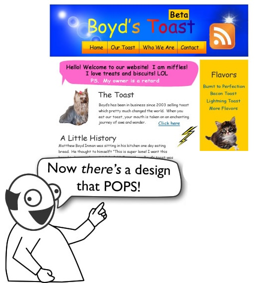

# Welcome!

  
[[The Oatmeal]](https://theoatmeal.com/comics/design_hell)

In this workshop, we are developing a portfolio webpage with Next.js, React, TypeScript, Tailwind, and MDX. 

## What You Will Learn

- How to build and compose reusable React components with props
- How Next.js App Router structures a multi-page site using the file system
- How to separate server-rendered and client-side-interactive code
- How to write typed data and components in TypeScript
- How to use Tailwind CSS v4 as a design system
- How to write rich content in MDX (Markdown with embedded React components)
- How to build a dynamic route, generating all pages at compile time

As prerequisites, you should be comfortable with basic HTML, CSS, and JavaScript fundamentals. 
  
  
  
[Let's start...🤩](./tutorial/index.md)